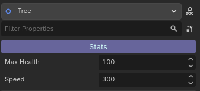
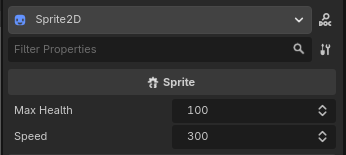
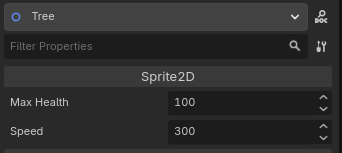

# ExposeMe

ExposeMe is a Godot 4 C# editor plugin that shows selected child-node properties directly in a parent node inspector.
No need for a lot of extra code. Just use `[ExposerNode]` and `[Expose]` and you are done.

It is useful when your scene is split into components and you want to edit important child values from one place, without selecting each child manually.

## What It Does

- Scans children (and deeper descendants) of a selected parent node.
- Finds members marked with `[Expose]`.
- Renders custom editor controls in the parent inspector.
- Supports style customization for section headers with `[ExposeStyle]`.
- Only activates on parent scripts marked with `[ExposerNode]`.

## How To Use

1. Enable the plugin in Godot.
    - Open Project -> Project Settings -> Plugins.
    - Enable ExposeMe.
2. Mark the parent class where you want to expose child properties with `[ExposerNode]`.
3. Mark child members you want to show with `[Expose]`.
4. (Optional) You can customize the child section header with `[ExposeStyle]`.

### Basic Example

Parent script:
```csharp
using Godot;

[ExposerNode]
public partial class ParentNode : Node2D
{
}
```

Child script:
```csharp
using Godot;

// Optional
[ExposeStyle(
    BackgroundColorHex = "#67659b",
    FontColorHex = "#cdf5f5",
    FontSize = 13,
    Label = "Stats"
)]
//Optional


public partial class ChildNode : Sprite2D
{
    [Export] [Expose] public int MaxHealth { get; set; } = 100;
    //OR
    [Export, Expose] public int Speed { get; set; } = 300;
}
```
When you select the parent node (`ParentNode`), the exposed values from `ChildNode` appear in the parent inspector.

You can also add some style to the child section header by using `[ExposeStyle]` on the child script. 
Right now you can:
- `BackgroundColorHex` to change the background color.
- `FontColorHex` to change the font color.
- `FontSize` to change the font size.
- `Label` to change the label text.

The following example would look like this in the parent inspector:

```csharp
[ExposeStyle(BackgroundColorHex = "#393939", FontColorHex = "#DCDCDC", FontSize = 13, Label = "Stats")]
```
 


## Example prints:

*Child node editor:*

 


*Parent node editor:*




## Supported Types

ExposeMe currently supports:

- `bool`
- `int`, `long`
- `float`, `double`
- `string`
- `Vector2`
- `Vector3`
- `Texture2D`
- (Experimental not active) `Texture2D[]`
- (Experimental not active) `Godot.Collections.Array<Texture2D>`

You can uncomment the code in `ExposeInspector.cs` to enable support for `Texture2D[]` and `Array<Texture2D>`. Be aware some actions will crash the editor, like drag and drop, buttons... So use it with caution. If you really need this feature let me know and I will try to implement it properly.

## Attributes Reference

### `[ExposerNode]`
Apply to the parent script class. ExposeMe only runs for selected nodes with this attribute.

### `[Expose]`
Apply to public fields or properties in child scripts. Only marked members are shown.

### `[ExposeStyle]`
Apply to child script class to customize the group header in the parent inspector.

Available optional properties:

- `BackgroundColorHex` example: `"#c43939"`
- `FontColorHex` example: `"#DCDCDC"`
- `FontSize` example: `10`
- `Label` example: `"Options"`

## License

This plugin is available under the MIT License. See the LICENSE file for more details.

## FAQ

#### Will this work if the node that has the properties is not a direct child of the node that exposes them?
Yes. The plugin scans descendants recursively, not only direct children.

#### Do exposed members need `[Export]`?
No for visibility in the ExposeMe panel. Yes if you want value persistence in scenes/resources through Godot serialization.

#### Why do I not see anything in the parent inspector?
Check all of the following:

- The plugin is enabled.
- The selected parent class has `[ExposerNode]`.
- The child member is public and marked with `[Expose]`.
- The parent and child scripts are compiled successfully.
- You rebuilt the project in Godot after changes.

#### Can I use this in runtime/game UI?
No. This plugin is editor tooling. It is intended for inspector editing in the Godot editor.

#### Can I expose unsupported types?
Not yet. You can add support by implementing a new `EditorProperty` and wiring that type in the plugin inspector factory.

## Notes
If you want to contribute, please check the `src/ExposeMe/Editor/Properties` folder for existing property implementations. You can add your own property type by creating a new class that inherits from `EditorProperty` and implementing the necessary logic to display and edit the property in the inspector.

I will be adding fixes and new features in the future, when I see that I also need them for my own projects. If you have any suggestions or feature requests, please open an issue and I will consider adding it.

Also if you want me to add support for a specific type, please open an issue and I will consider adding it. I would be happy to help you with that.

Thank you for using ExposeMe!